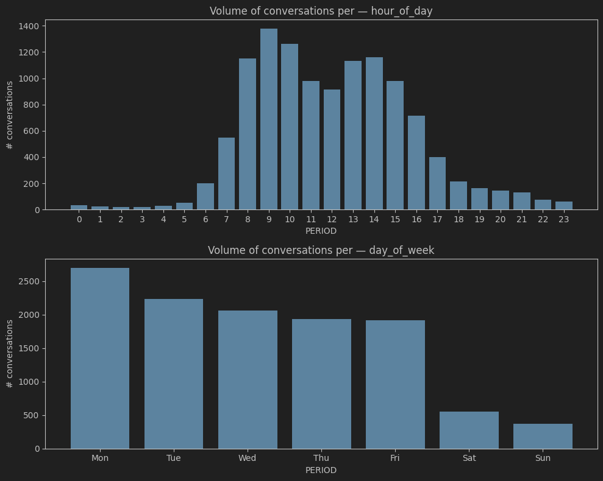
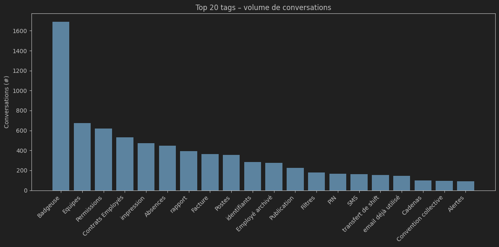
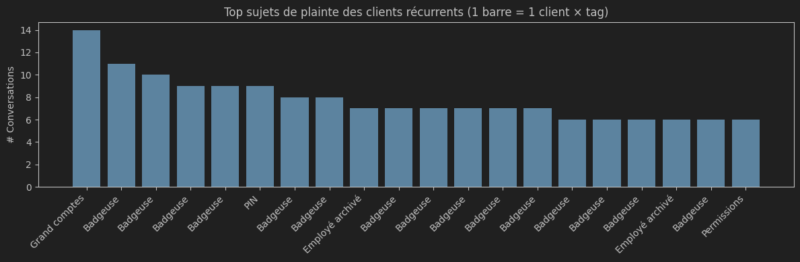
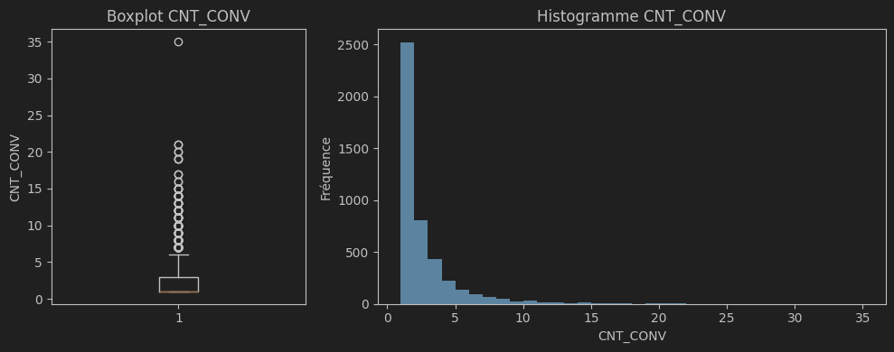

# Skello · Intercom — Étude de cas *Data Analyst*

## Sommaire
1. [Modélisation dbt](#modélisation-dbt)
2. [Template & reporting hebdomadaire](#template--reporting-hebdomadaire)
3. [Analyses ad-hoc](#analyses-ad-hoc)
4. [Pistes d’analyses futures](#pistes-danalyses-futures)

---

## Modélisation dbt
### 1. Ingestion *seeds*  
* Deux fichiers CSV (« conversations », « conversation_parts ») + un troisième contenant les **4 membres du support** ont été chargés tels quels dans le schéma **`RAW`**.

### 2. Staging  
* Requêtes *stg* : normalisation des noms de colonnes, dé-duplication (`ROW_NUMBER … QUALIFY`), suppression des enregistrements sans `conversation_id`.

### 3. Modèle analytique  
| Couche | Objet | Schéma | Matérialisation | Notes                                                      |
|--------|-------|--------|-----------------|------------------------------------------------------------|
| **DIM** | `dim_conversations` `dim_assignees` `dim_support_team_members` | `DEV` | *view* | colonnes JSON, timestamp, tags → `ARRAY`, sélection champs |
| **FCT** | `fct_conversation_parts` | `DEV` | *table* | colonnes JSON, timestamp, sélection champs                       |

Les schémas de sortie et la matérialisation sont pilotés dans `sources.yml` et `dbt_project.yml`.

### 4. Analyses *analyses/*  
Le SQL **`team_metrics.sql`** regroupe les KPI à valider par le métier ; il pourra évoluer en table pérenne si besoin.

---

## Template & reporting hebdomadaire
### Lien (Looker Studio)  
<https://lookerstudio.google.com/reporting/6641bf95-ae5f-4ebd-8442-115d371743fc>

### Contenu
| KPI | Détail                                                                        | Filtre / Périodicité |
|-----|-------------------------------------------------------------------------------|----------------------|
| **Volume** de conversations | par employé, agrégation hebdo                                                 | semaine / employé    |
| **CSAT** | note 4-5                                                                      | semaine / employé    |
| **% notes ≤ 2** | note 1-2                                                                      | semaine / employé    |
| **Temps moyen de première réponse** | calcul sur **jours ouvrés (lun-ven 9 h-18 h)** et jours où l’équipe a répondu | semaine / employé    |
| **SLA 5 mn** | % conv. > 5 min                                                               | semaine / employé    |
| **% conversations taguées** | visibilité produit                                                            | semaine / employé    |
| **Séries temporelles** | CSAT, SLA, temps réponse                                                      | scope global         |

#### Points saillants
* Charge très déséquilibrée : **Héloïse** prend l’essentiel des conversations.  
* Tendance haussière du **temps de réponse moyen** et du **SLA > 5 min**.  
* **CSAT** satisfaisant/élevé (> 80%) 

#### Limites du rapport (outil BI gratuit) & améliorations possibles
* Drill-down global → employé est indisponible dans Looker Studio Free.  
* Graphes temporels affectés par le filtre semaine; nécessiterait un champs date *Fixed*.  
* Ajout de filtres `priority`, `is_read`.

#### Questions à clarifier en amont avec Lorette

| Thème | Questions clés                                                                                               | Pourquoi c’est utile                                                                                                   |
|-------|--------------------------------------------------------------------------------------------------------------|------------------------------------------------------------------------------------------------------------------------|
| **Satisfaction & rétention** | *Quels éléments du parcours client ont, selon toi, le plus d’impact sur la satisfaction ?*                   | Apprendre de sa connaissance métier.                                                                                   |
| | *Les moteurs de rétention sont-ils identiques à ceux de la satisfaction ?*                                   | Vérifier que le reporting couvre à la fois CSAT et churn.                                                              |
| **Processus support** | *Un ticket peut-il être pris en charge par plusieurs employés ?*                                             | Déterminer la bonne granularité pour le suivi individuel. Certains membres de l'équipe étant absents du rapport final. |
| | *Faut-il distinguer conversations « Assignee » et « Teammate » ?*                                            | Mettre à jour le rapport avec tous les membres de l'équipe.                                                            |                               |

> **But :** s’assurer que les métriques et la modélisation répondent exactement aux besoins métier.
---

## Analyses ad-hoc

Ci-dessous les principaux enseignements tirés des explorations hors reporting :

- Le volume de conversations culmine **sur les plages ouvrées** ; le **lundi** est la journée la plus dense et l’activité démarre déjà entre **7 h 00 – 8 h 00**.  
- Le tag **Badgeuse** concentre **plus du double** du volume du second sujet produit.  
- **10 %** des utilisateurs ont sollicité le support **5 fois ou plus** ; un record à **35 connexions**.

### Volume de conversations — agrégation temporelle
Histogrammes du nombre de conversations créées **par heure** et **par jour** : utiles pour calibrer les shifts de l’équipe support.  

### Volume par sujet produit (tag)
Nombre de conversations par **tag**. La Badgeuse ressort très nettement comme source principale de tickets.  

Quand on se focalise sur les clients les plus récurrents, la Badgeuse reste le sujet prédominant :  

### Nombre de contact support par utilisateur

Certains clients reviennent fréquemment. La distribution ci-dessous illustre cette récurrence :  

**Statistiques descriptives associées**

| Quartile / métrique | Valeur |
|---------------------|--------|
| 25 % des utilisateurs | ≥ 3 contacts |
| 10 % des utilisateurs | ≥ 5 contacts |
| Moyenne | **2,2** contacts |
| Maximum observé | **35** contacts |

> **Recommandation** : pour les comptes « hyper-demandeurs », un suivi proactif (appel hebdomadaire ou mensuel) serait probablement plus efficace qu’une suite de conversations pop-up isolées.

---

## Recommandations pour des analyses futures
Compte tenu de l’accès aux données pertinentes, les analyses suivantes pourraient nous apporter davantage d’informations sur ce qui importe au client :
1. **Exploiter le contenu textuel des conversations**  
   - En intégrant le corps des messages, il devient possible d’appliquer, relativement facilement, des LLM afin de:
     * classifier, et par le même temps quantifier, automatiquement les thèmes abordés.  
     * mesurer le sentiment ou le ton de chaque échange.  
   - Résultat attendu: une compréhension plus fine des features produits problématiques et une meilleure compréhension des utilisateurs en difficulté avec le produit.

2. **Accès aux comportements des utilisateurs sur la plateforme** 
   - Créer un indicateur d’effort client (_Interactions Until Resolution_ = documentation web + conversation + transferts).
     - Après lecture du livre _The Effortless Experience_, il ressort que l'effort perçu par le client pour la résolution d'un problème a plus d'impact sur la fidélité que la simple satisfaction. Cette méthodologie pour minimiser l'effort perçue a été adoptée par plusieurs SaaS (e.g, Intercom - https://www.intercom.com/learning-center/customer-success-metrics-saas).
     - Il faut néanmoins avoir en tête certains points de vigilance: c'est une étude B2C (les cycles B2B sont plus longs) qui utilise des métriques déclaratives (et non observées) de loyauté.
     - À tester : pouvoir prédictif de l’effort sur la rétention avant d’en faire un KPI Support.
3. **Croiser performance support et rétention long terme**  
   - Disposer de l’historique « clients conservés vs. churnés » (12 mois ou plus) permettrait de tester la corrélation avec par exemple:  
     * la note CSAT moyenne,  
     * le nombre total de conversations,  
     * l’effort de résolution (nombre de points de contact).  
   - Objectif : confirmer ou infirmer que ces KPI sont de bons prédicteurs de churn, et ajuster le tableau de bord en conséquence (passer d’indicateurs descriptifs à de vrais signaux d’alerte).
